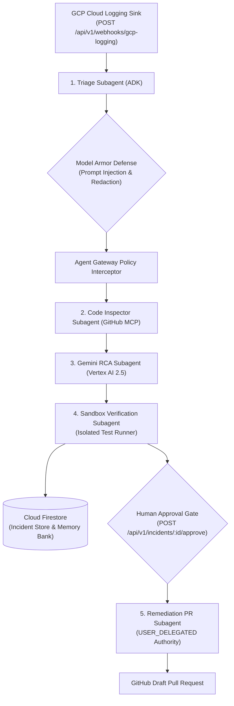

# NightZero Agent 🌌
### Multi-Subagent Autonomous SRE Engine powered by Google Cloud Vertex AI & ADK

[](https://nightzero-agent-164161200079.us-central1.run.app)
[](https://cloud.google.com/vertex-ai)
[](https://nightzero.web.app)
[](LICENSE)

---

## 📌 Overview

**NightZero Agent** is the core backend autonomous engine of the NightZero platform. It continuously ingests production telemetry alerts from Google Cloud Logging error sinks, orchestrates multi-subagent root-cause forensics via **Gemini 2.5 Flash/Pro**, sanitizes payloads via **Model Armor**, enforces **SPIFFE/X.509** identity, verifies candidate patches in ephemeral polyglot sandboxes, and gates GitHub Pull Request remediation behind cryptographic human approval.

---

## 🏛️ Multi-Subagent Architecture



---

## ⚡ Key Capabilities

1. **Native Vertex AI Integration**: Uses `google-genai` SDK with Vertex AI backend (`project=nightzero`, `location=us-central1`). Supports `gemini-2.5-flash` (~0.8s latency), `gemini-2.5-pro` (max reasoning), and `gemini-2.5-flash-lite`.
2. **Model Armor AI Firewall**: Inline prompt injection defense, credential/PII redaction, and code patch AST safety analysis.
3. **SPIFFE Cryptographic Identity**: Attested personas (`spiffe://nightzero.io/agent/*`) with HMAC-SHA256 Agent Identity Tokens (`ait-sha256-...`).
4. **Self-Learning Polyglot Sandbox**: Auto-discovers language test runners (Python, TS/JS, Go, Rust, Java) and caches profiles in Firestore Memory Bank.
5. **Human-in-the-Loop Gate**: Strictly enforces `USER_DELEGATED` authority before creating GitHub branches or pull requests.

---

## 🛠️ Local Development & Quickstart

```bash
# 1. Setup Virtual Environment
python3 -m venv .venv
source .venv/bin/activate
pip install -e .

# 2. Configure Environment
cp .env.example .env

# 3. Run Test Suite
python3 -m unittest discover -s tests -v

# 4. Start the Agent Service
python3 -m nightzero
```

---

## 📡 REST API Reference

| Method | Endpoint | Description |
| :--- | :--- | :--- |
| `GET` | `/health` | Service health status and readiness check |
| `GET` | `/api/v1/incidents` | List all triaged and remediated incidents |
| `GET` | `/api/v1/incidents/{id}` | Fetch full incident details, AST diff, and timeline |
| `POST` | `/api/v1/incidents/{id}/approve` | Cryptographically authorize patch and open GitHub Draft PR |
| `GET` | `/api/v1/settings` | Get active model and available Vertex AI catalog |
| `POST` | `/api/v1/settings` | Update active model (`gemini-2.5-flash`, `gemini-2.5-pro`) |
| `GET` | `/api/v1/governance` | Fetch Agent Gateway RBAC and Model Armor telemetry |
| `POST` | `/api/v1/simulate-incident` | Ingest chaos outage regression for live demo verification |
| `POST` | `/api/v1/webhooks/gcp-logging` | Cloud Logging error sink ingestion webhook |
| `POST` | `/api/v1/webhooks/github` | GitHub issue and pull request event webhook |

---

## 📜 License
Licensed under the [Apache License 2.0](LICENSE).
